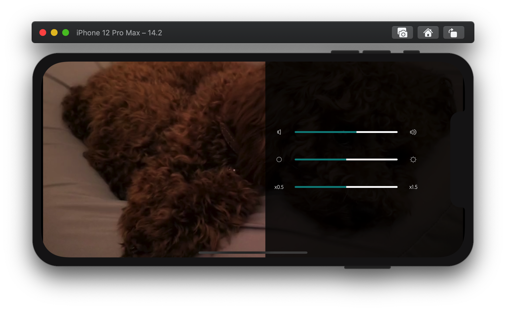

# YourTube

YourTube is a video APP on IOS. It implements the most elementary features of YouTube, in an elegant way.


## Features

To learn about the features:

1. If you use Win10, you can download this [PPT](yourtube.pptx) to learn more. 

   **Note**: Demo videos are embedded in the PPT. 

   **Note**: Recommend to use PowerPoint2016 or above. 

2. [Another Demo video avaluable on bilibili](https://www.bilibili.com/video/BV1Br4y1T7Xz/)
3. See screenshots below.

## Access

YourTube is not released, yet the only access to this app is to run the [front end program](https://github.com/chenguofan1999/YourTube-IOS) in xcode.

```sh
git clone https://github.com/chenguofan1999/YourTube-IOS.git
```

Then open `Final.xcworkspace` , build and run it on simulator. 

**Note**: IOS13 or above & iPhone X series are recommended. The first build may take minutes.


## Architecture


- Back End Repo: [github.com/chenguofan1999/IOS_Final_Backend](https://github.com/chenguofan1999/IOS_Final_Backend)

- Front End Repo: [github.com/chenguofan1999/YourTube-IOS](https://github.com/chenguofan1999/YourTube-IOS)


## Screenshots

### LogIn and SignUp

| Login                                    | SignUp                                    |
| ---------------------------------------- | ----------------------------------------- |
|  |  |

### Main Tabs

| Home Page                               |      |      | Explore Page                               |
| --------------------------------------- | ---- | ---- | ------------------------------------------ |
|  |      |      |  |


| Subscription Page                               | Subscription Page (user selected)                        |
| ----------------------------------------------- | -------------------------------------------------------- |
|  |  |

### User Page

| Info Page(self)                              | Info Page(other user)                                | Uploads Page                                   |
| -------------------------------------------- | ---------------------------------------------------- | ---------------------------------------------- |
|  |  |  |


| Likes Page                                    | History Page(only visible to self)              |
| --------------------------------------------- | ----------------------------------------------- |
|  |  |

 ### Post Page


| Post Page                                   | Post Page(filled)                                  |
| ------------------------------------------- | -------------------------------------------------- |
|  |  |

### Video Page





### Comment & Reply

| Comments                                    | Replies                                    |
| ------------------------------------------- | ------------------------------------------ |
|  |  |


 ### Other

| Search                                    | Tag                                      |
| ----------------------------------------- | ---------------------------------------- |
|  |  |


