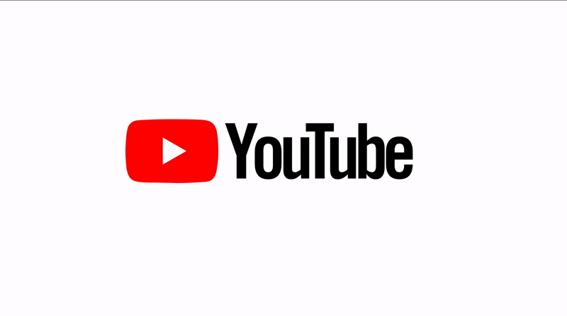

# YourTube

A video APP on IOS, It's Almost YouTube.





## Architecture


- Back End Repo: [github.com/chenguofan1999/IOS_Final_Backend](https://github.com/chenguofan1999/IOS_Final_Backend)

- Front End Repo: [github.com/chenguofan1999/YourTube-IOS](https://github.com/chenguofan1999/YourTube-IOS)


## Access

YourTube is not released, yet the only access to this app is to run the [front end program](https://github.com/chenguofan1999/YourTube-IOS) in xcode.

```sh
git clone https://github.com/chenguofan1999/YourTube-IOS.git
```

Then open `Final.xcworkspace` , build and run it on simulator. 

**Note**: IOS13 or above & iPhone X series are recommended. The first time to build may take minutes.


## Features

YourTube implements the most elementary features of YouTube.


### Learn more

1. You can download the [PPT](yourtube.pptx) to learn more. 

   **Note**: Demo videos are embedded in the PPT. 

   **Note**: Recommend to use PowerPoint2016 or above. 

2. [Another Demo video avaluable on bilibili](https://www.bilibili.com/video/BV1Br4y1T7Xz/)

## Screenshots

### LogIn and SignUp

| Login                                    | SignUp                                    |
| ---------------------------------------- | ----------------------------------------- |
|  |  |

### Main Tabs

| Home Page                               | Subscription Page                                            | Explore Page                               |
| --------------------------------------- | ------------------------------------------------------------ | ------------------------------------------ |
|  |   |  |


