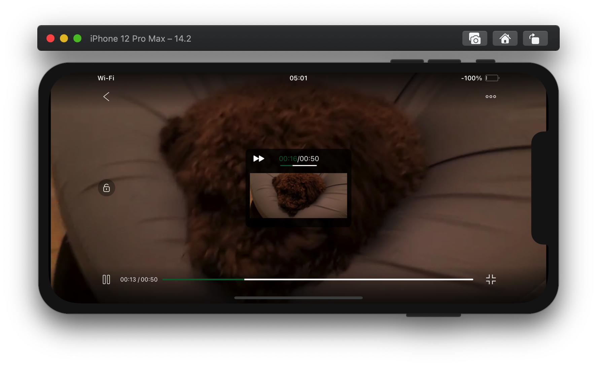
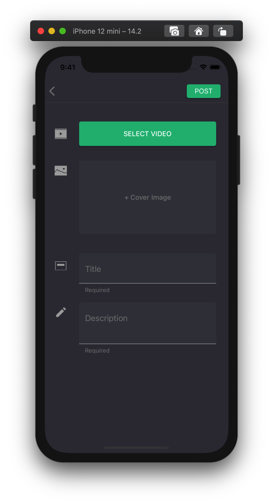

# YourTube 的前端实现

## 开发的纲领

YourTube 的前端开发在一开始就确定了纲领，包括开发的目的和对程序的目标。之后两周多的开发自始至终围绕着它们进行。

### 目的

开发 YourTube 的**目的**是模仿和实现一个成熟的现代IOS APP, 在实现各模块的过程中锻炼以下能力：

1. 深入掌握UIKit, 学习最佳实践。

2. 熟悉检索、导入、使用和管理来自第三方的库和框架的流程。为了这个目标此次项目中刻意地尝试了大量的第三方库， 从最终的 podfile 能体现。不过这也已经是淘去大部分不满意的库之后的结果了。

   ```sh
   pod 'AFNetworking'
   pod 'DZNEmptyDataSet'
   pod 'UITextView+Placeholder'
   pod 'SDWebImage'
   pod 'CYLTabBarController'
   pod 'Masonry'
   pod 'MaterialComponents/TextControls+OutlinedTextFields'
   pod 'MaterialComponents/TextControls+FilledTextFields'
   pod 'MaterialComponents/TextControls+OutlinedTextAreas'
   pod 'MaterialComponents/TextControls+FilledTextAreas'
   pod ‘MaterialComponents/Buttons+Theming’
   pod 'MaterialComponents/Dialogs'
   pod 'MaterialComponents/Tabs+TabBarView'
   pod 'MaterialComponents/Cards+Theming'
   pod 'MJRefresh'
   pod 'SJVideoPlayer'
   pod 'FTPopOverMenu'
   pod 'MXSegmentedPager'
   pod "MXParallaxHeader"
   
   ```

   值得一提的是 Google 的 Material 组件，谷歌推崇的 Material Design 是面向安卓的程序设计规范，同时谷歌也做了对应组件的实现。但谷歌同时也对 IOS 做了部分组件的实现，这一部分内容不完整，文档不齐全，Material Design 与 UIKit 本身也没有那么相合，但其中部分组件仍是足够优雅值得尝试的。 

3. 练习 OC 的高级特性, 代理、KVO、block。事实上在我的开发过程中，对这些特性的需求是自然而然产生的，例如对响应式编程的需求会推动我尝试怪异而不安全的 KVO , 对类重用和跨界面响应的需求让我不得不采用自定义协议的办法。

   

### 目标

1. 优雅。在外观和设计上不能做妥协，最终的成品一定要是优雅的。
2. 代码规范。严格遵守 MVC 模式；最大化地做到代码重用。
3. 实现 YouTube 的最基本的一系列功能，在功能上能构成一个完整的闭环。
4. 性能良好。这一目标是相对自己的期中项目提出的，成品应该是流畅的，合格的移动应用不应该出现任何形式的卡顿。


## 技术选择&具体实现

YourTube 的前端代码一共7000行，已是规模不小的项目。在开发过程中遇到并克服的小问题数以百计，大部分已无法复述，因此仅提及关键部分的**技术选择**，或具体实现。

 ### 1. 视频播放

视频被上传到后端后，后端通过文件服务提供视频的URL，因此在前端对视频播放组件的基本需求是：

- 一个仅根据视频 URL  能直接播放视频的播放器组件

IOS的视频播放主要基于苹果提供的 AVPlayer，需要开发者通过实现代理的方式控制视频的播放。在16年以后苹果提供了官方的 AVPlayerController, 能十分简单地实现上述需求，它拥有了这些功能：

- 简洁而完备的进度条
- 全屏控制

但相比于现代的视频软件的播放器，在功能上仍稍显过时，我对视频播放组件的额外需求是：

- 左右滑动控制进度条，并有对应的 UI 
- 上下滑动控制音量和亮度，并有对应的 UI

因此我尝试了 Github 上大量的 Objective-C 的视频播放器，最终选择了 [SJVideoPlayer](https://github.com/changsanjiang/SJVideoPlayer)

SJVideoPlayer 十分强大，有很多可自定义的额外功能。这里直接使用默认的配置，对应代码十分简短：

```objective-c
- (SJVideoPlayer *)player
{
    if(_player == nil)
    {
        _player = [SJVideoPlayer player];
        NSURL *URL = [NSURL URLWithString:[NSString stringWithFormat:@"http://159.75.1.231:5009%@",self.contentItem.videoURL]];
        _player.URLAsset = [[SJVideoPlayerURLAsset alloc] initWithURL:URL];

        SJVideoPlayer.update(^(SJVideoPlayerSettings * _Nonnull commonSettings) {
            commonSettings.progress_traceColor = [AppConfig getMainColor];
            commonSettings.progress_bufferColor = [UIColor whiteColor];
        });
    }
    return _player;
}
```

效果即为下图中视频区域：


全屏模式下： 



这样开箱即用的工具是开源社区价值的极佳体现。

### 2. 下拉刷新&上拉加载

下拉刷新和上拉加载在现代应用中已十分普遍，并成为了大部分手机用户共同的使用习惯。这一部分选择了 [MJRefresh](https://github.com/CoderMJLee/MJRefresh). 

MJRefresh 同样是一个开箱即用的组件，整个程序相关的代码不足十行，这是在一个 tableView 中的例子:

```objective-c
self.tableView.mj_header = [MJRefreshNormalHeader headerWithRefreshingTarget:self refreshingAction:@selector(loadData)];
self.tableView.mj_footer = [MJRefreshBackNormalFooter footerWithRefreshingTarget:self refreshingAction:@selector(loadMoreData)];
```

**效果：**


### 3. 选取 album 中的视频

这是上传视频时的需求, 点击 `SELECT VIDEO` 后应弹出相册，用户选择后上传。



实现这一需求的控件是 "picker" ，比如 UIKit 中的 UIImagePicker ，以及 github 上数百个附带编辑功能的第三方 picker. 

UIImagePicker一般足以实现这一功能，方法如下：

1. 通过设置选取的内容类型让相册只显示支持的视频类型文件
2. 选取成功后 UIImagePicker 会自动压缩文件并转存到程序可以操纵的app沙盒中
3. 通过选取得到的 Info 字典的 ...mediaURL 字段获取沙盒中该视频的 URL
4. 此时可以通过该 URL 直接构造 NSData , 接下来只需要通过 AFNetworking 发送该 NSData 即可

但不幸的是在我的开发过程中  UIImagePicker 具有很大概率选取失败。我最终选择了苹果在 IOS14 才提供的 PHPicker. PHPicker 是苹果提供的在未来取代 UIImagePicker 的工具，在这里能正常的工作，但需要手动转存至沙盒中，上传完毕后手动删除。以下是此页面中


- 点击选视频按钮触发事件:

  ```objc
  #pragma mark 选视频事件
  - (void)selectVideoButtonClicked
  {
      PHPickerConfiguration *config = [[PHPickerConfiguration alloc] init];
      config.selectionLimit = 1;
      config.filter = [PHPickerFilter videosFilter];
      PHPickerViewController *pickerViewController = [[PHPickerViewController alloc] initWithConfiguration:config];
      pickerViewController.delegate = self;
      
      
      if(self.videoURL == nil)
      {
          [self presentViewController:pickerViewController animated:YES completion:nil];
      }
      else
      {
          UIAlertController *actionSheet = [UIAlertController alertControllerWithTitle:nil message:nil preferredStyle:UIAlertControllerStyleActionSheet];
          UIAlertAction *changeVideoAction = [UIAlertAction actionWithTitle:@"Select From Album" style:UIAlertActionStyleDefault handler:^(UIAlertAction * _Nonnull action) {
              
              [self presentViewController:pickerViewController animated:YES completion:nil];
              }];
          UIAlertAction *cancelAction = [UIAlertAction actionWithTitle:@"Cancel"
                                                                     style:UIAlertActionStyleCancel
                                                                   handler:nil];
          UIAlertAction *preViewVideoAction = [UIAlertAction actionWithTitle:@"Preview" style:UIAlertActionStyleDefault handler:^(UIAlertAction * _Nonnull action) {
              [self presentViewController:[[PreViewController alloc] initWithURL:self.videoURL] animated:YES completion:nil];
          }];
          
          [actionSheet addAction:changeVideoAction];
          [actionSheet addAction:cancelAction];
          [actionSheet addAction:preViewVideoAction];
          
          [self presentViewController:actionSheet animated:YES completion:nil];
      }
  }
  ```

  

- 对 PHPickerViewControllerDelegate 的实现：

  ```objc
  #pragma mark PHPickerViewControllerDelegate
  #define CachePathForURL(url) [[NSSearchPathForDirectoriesInDomains(NSCachesDirectory, NSUserDomainMask, YES) lastObject] stringByAppendingPathComponent:[url lastPathComponent]]
  - (void)picker:(nonnull PHPickerViewController *)picker didFinishPicking:(nonnull NSArray<PHPickerResult *> *)results {
      [picker dismissViewControllerAnimated:YES completion:nil];
      for (PHPickerResult *result in results)
      {
          [result.itemProvider loadFileRepresentationForTypeIdentifier:@"public.movie" completionHandler:^(NSURL * _Nullable url, NSError * _Nullable error) {
              NSLog(@"before: %@",url);
              
              // 在沙盒中另存一份
              NSData *videoData = [NSData dataWithContentsOfURL:url];
              NSString *newPath = CachePathForURL(url);
              [videoData writeToFile:newPath atomically:YES];
              NSLog(@"after: %@",newPath);
              self.videoURL = [NSURL URLWithString:[NSString stringWithFormat:@"file://%@",newPath]];
              
              // 获取时长
              AVURLAsset *asset = [AVURLAsset assetWithURL:self.videoURL];
              CMTime time = [asset duration];
              NSLog(@"时长 : %lf s", ceil(time.value/time.timescale));
              self.videoDuration = ceil(time.value/time.timescale);
          
              dispatch_async(dispatch_get_main_queue(), ^{
                  [self.selectVideoButton setBackgroundColor:self.POSTSurfaceColor];
                  [self.selectVideoButton setTitle:@"✓  Video Selected" forState:UIControlStateNormal];
                  [self.selectVideoButton setTitleColor:self.POSTButtonColor forState:UIControlStateNormal];
              });
          }];
      }
  }
  ```

  

