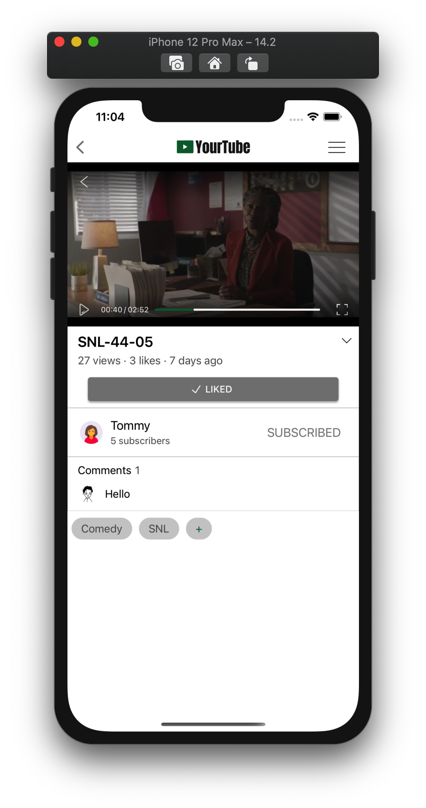
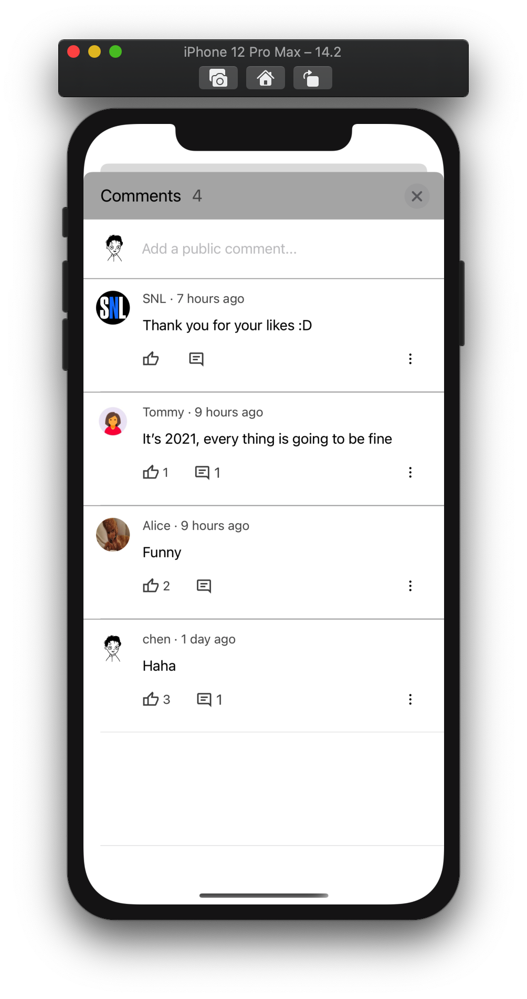

## 实现文档

这是一份粗略的实现文档。

## 开发目标

YourTube 的开发在一开始就确定了开发的具体目标。之后多周的开发自始至终围绕着它们进行。

### 后端部分

#### 个人期望

由于在服务计算课学习过 go 语言并用 go 语言写过 web 服务，因此这次仍选用这一语言 ，意在

1. 复习数据库基础。
2. 练习 golang。
3. 锻炼快速搭建高质量 web 服务的能力。 

#### 产品目标

一个规范的、健壮的、易于维护的、易于扩展的服务端程序。

1. 规范：
   1. 遵循后端的 MVC 模式，对服务端的业务进行必要且合理的分层。
   2. 接口设计尽可能遵照 RESTful 规范。
2. 健壮：需要能保证服务的可持续性和数据的正确性、一致性。
3. 易于维护：具有详细而不冗余的**错误定位机制**，在程序出错时能及时定位到出错的层次(利用好 go 语言的错误处理机制，做出合理的错误处理设计)。
4. 易于扩展：对后端的扩展是极其常见的需求，有时是由于初期实现时的遗漏，有时是由于功能和业务的增加，有时是为了前端效率而对 API 进行优化。

同时吸取期中项目根据糟糕后端实现前端的经验，对后端有额外要求：

1. 接口服务于前端，一次性提供一个页面**全部所需**且**无冗余**的数据。
2. 在后端处理几乎所有业务逻辑，不要将复杂的业务交给前端实现。例如内容的排序、搜索和筛选。

### 前端部分

#### 个人期望

前端部分开发的期望是模仿和实现一个成熟的现代IOS APP, 在实现各模块的过程中锻炼以下能力：

1. 掌握各种常见页面实现的**最佳实践**，而不是闭门造车。

2. 熟悉检索、导入、使用和管理来自第三方的库和框架的流程。

3. 练习应用 OC 的**高级特性**，代理、KVO、block...事实上随着开发的深入和推进，对这些特性的需求是自然而然产生的，例如对响应式编程的需求会推动我尝试怪异而不安全的 KVO , 对更好的类重用和跨界面响应的需求让我不得不使用更多的自定义协议。


#### 产品目标

1. 优雅。在外观设计上雕琢，最终的成品要是优雅的。
2. 代码规范，严格遵守 MVC 模式。同时最大化地做到代码重用，尤其是类的重用。
4. 实现 YouTube 的最基本的一系列功能，在功能上能构成一个完整的闭环。
5. 性能良好。这一目标是相对自己的期中项目提出的，成品应该是流畅的，合格的移动应用不应该出现任何形式的卡顿。

## 后端的实现

### 技术选择 

后端的开发使用的是 golang + gin 框架的组合，gin 是 golang 的一个被广泛使用的 web 框架。后端运行在自己租用的腾讯云服务器上，向前端提供公网可访问的 RESTful API。

服务器的公网ip：159.75.1.231

API 的接口：5009

API 基址：http://159.75.1.231:5009

### 开发阶段

在 YourTube 的开发过程中，前后端并非同时开工，而是先根据大致需求实现功能接口几乎齐全的后端，再开始实现前端，同时按需求扩展后端。由此可见后端的开发分为两阶段:

#### 1. 集中开发阶段。

后端开发的绝对主要阶段，这一阶段做的工作有：

1. 设计好数据库。本项目的数据库共用到了11张表：

   ```mysql
   mysql> show tables;
   +---------------+
   | Tables_in_ios |
   +---------------+
   | comments      |
   | content_tags  |
   | contents      |
   | follow        |
   | history       |
   | like_comment  |
   | like_content  |
   | like_reply    |
   | replies       |
   | user_tags     |
   | users         |
   +---------------+
   11 rows in set (0.00 sec)
   ```

   需要为每张表的各字段选择合适的数据类型，设计好表之间的约束关系，合理程度地遵循第三范式，保证数据一致性，同时不至于产生过于复杂的查询给服务器带来性能负担。

2. 设计 RESTful API 。需要按 REST 规范设计大部分接口，同时需要斟酌哪些部分有不遵守 REST 原则的必要。API大致如下:

   base URL： http://159.75.1.231:5009

   ```go
   用户服务
       注册与登录
       POST   /signup           注册
       POST   /login            登录
   
       用户信息
       GET    /users/{username} 获取某用户详细信息
       GET    /user             获取自己的用户信息
       PUT    /user/bio         更新自己的简介
       PUT    /user/avatar      更新自己的头像
       POST   /user/avatar      更新自己的头像（为了适配AFNetworking增加的冗余接口）
       GET    /user/tags        为自己增加关注的 tag
       POST   /user/tags        为自己增加关注的 tag
       DELETE /user/tags        为自己删除关注的 tag
   
       关注
       GET    /users/{username}/followers   获取某用户关注者
       GET    /users/{username}/following   获取某用户关注的人
       GET    /user/following/{username}    检查是否已关注某用户
       PUT    /user/following/{username}    关注某用户
       DELETE /user/following/{username}    取消关注某用户
   
   Content 服务
       GET    /contents              获取内容集(通过query参数筛选和排序)
       POST   /contents              发布内容
       GET    /contents/{contentID}  获取某条内容的详细信息
       DELETE /contents/{contentID}  删除内容，仅能删除自己发出的内容
       POST   /content/tags          为内容增加 tag , 仅能为自己发的内容增加标签
       DELETE /content/tags          为内容删除 tag , 仅能为自己发的内容删除标签
   
   Comment 服务
       GET    /comments             获取评论集(通过query参数筛选和排序)
       POST   /comments             发布评论
       DELETE /comments/{commentID} 删除评论, 仅能删除自己发的评论
   
   Reply 服务
       GET    /replies           获取回复集(通过query参数筛选和排序)
       POST   /replies           发布回复
       DELETE /replies/{replyID} 删除回复, 仅能删除自己发的回复
   
   Like
       PUT    /like/content/{contentID}   喜欢某条内容
       DELETE /like/content/{contentID}   取消喜欢某条内容
       PUT    /like/comment/{commentID}   喜欢某条评论
       DELETE /like/comment/{commentID}   取消喜欢某条评论
       PUT    /like/reply/{replyID}       喜欢某条回复
       DELETE /like/reply/{replyID}       取消喜欢某条回复
   ```

3. 为后端建立清晰的架构。我的后端采取的同样是 MVC 的模式( view 层可以认为是客户端)：

   

4. 实现初期设计的 API 的全部服务。

### 2. 按需扩展阶段。

在实现客户端时如果需要增加新的业务，或者为了优化的目的希望后端提供更直接的接口，在实际的企业开发过程中可能涉及到前后端开发人员的沟通，不过在此项目中就方便了很多 —— 可以一边写前端，一边直接修改和扩展在服务器中运行的后端程序，立即进行简单的测试后直接运行部署。

**需要强调的是**，此时在后端开发初期搭建的结构的**可扩展性**将显得十分重要: 无论后端分层过于粗略，层级过少，还是分层过细，层级过多，都会导致扩展后端的工作量显著加大，前者还容易带来不可忽视的稳定性问题。此次后端使用的 MVC 分层，实际上为两层，在做拓展时十分舒适，往往十分钟左右便能拓展出一个稳定的新服务。

一个例外是在拓展阶段创建**全新资源**对应的服务，这将会耗费相当多的时间，因为需要从后端的最底层开始建立。因此尽量在开始阶段便设计好需要的所有资源，例如如果希望程序中有历史记录功能，那最好在开始设计数据库时便创建 history 表，并在 model 层实现基本的 CRUD 操作。

## 前端的实现

YourTube 的前端代码一共7000行，已是规模不小的项目。在开发过程中遇到并克服的小问题数以百计，大部分已无法复述，因此仅提及关键部分的技术选择，设计考量或具体实现。

### 技术选择

此次项目中刻意地尝试了大量的第三方库， 从最终的 podfile 能体现。不过这也已经是淘去大部分不满意的库之后的结果了。

```sh
pod 'AFNetworking'
pod 'DZNEmptyDataSet'
pod 'UITextView+Placeholder'
pod 'SDWebImage'
pod 'CYLTabBarController'
pod 'Masonry'
pod 'MaterialComponents/TextControls+OutlinedTextFields'
pod 'MaterialComponents/TextControls+FilledTextFields'
pod 'MaterialComponents/TextControls+OutlinedTextAreas'
pod 'MaterialComponents/TextControls+FilledTextAreas'
pod 'MaterialComponents/Buttons+Theming'
pod 'MaterialComponents/Dialogs'
pod 'MaterialComponents/Tabs+TabBarView'
pod 'MaterialComponents/Cards+Theming'
pod 'MJRefresh'
pod 'SJVideoPlayer'
pod 'FTPopOverMenu'
pod 'MXSegmentedPager'
pod 'MXParallaxHeader'
```

 ### 1. 使用 SJVideoPlayer 播放视频

视频被上传到后端后，后端通过文件服务提供视频的URL，因此在前端对视频播放组件的基本需求是：

- 一个仅根据视频 URL  能直接播放视频的播放器组件

IOS的视频播放主要基于苹果提供的 AVPlayer，需要开发者通过实现代理的方式控制视频的播放。在16年以后苹果提供了官方的 AVPlayerController, 能十分简单地实现上述需求，它拥有了这些功能：

- 简洁而完备的进度条
- 全屏控制

但相比于现代的视频软件的播放器，在功能上仍稍显过时，我对视频播放组件的额外需求是：

- 左右滑动控制进度条，并有对应的 UI 
- 上下滑动控制音量和亮度，并有对应的 UI

因此我尝试了 Github 上大量的 Objective-C 的视频播放器，最终选择了 [SJVideoPlayer](https://github.com/changsanjiang/SJVideoPlayer)

SJVideoPlayer 十分强大，有很多可自定义的额外功能。这里直接使用默认的配置，对应代码十分简短：

```objective-c
- (SJVideoPlayer *)player
{
    if(_player == nil)
    {
        _player = [SJVideoPlayer player];
        NSURL *URL = [NSURL URLWithString:[NSString stringWithFormat:@"http://159.75.1.231:5009%@",self.contentItem.videoURL]];
        _player.URLAsset = [[SJVideoPlayerURLAsset alloc] initWithURL:URL];

        SJVideoPlayer.update(^(SJVideoPlayerSettings * _Nonnull commonSettings) {
            commonSettings.progress_traceColor = [AppConfig getMainColor];
            commonSettings.progress_bufferColor = [UIColor whiteColor];
        });
    }
    return _player;
}
```

效果即为下图中视频区域：



全屏模式下： 


这样开箱即用的工具是开源社区价值的极佳体现。

### 2. 使用 MJRefresh 实现下拉刷新&上拉加载

下拉刷新和上拉加载在现代应用中已十分普遍，并成为了大部分手机用户共同的使用习惯。这一部分选择了 [MJRefresh](https://github.com/CoderMJLee/MJRefresh). 

MJRefresh 同样是一个开箱即用的组件，整个程序相关的代码不足十行，这是在一个 tableView 中的例子:

```objective-c
self.tableView.mj_header = [MJRefreshNormalHeader headerWithRefreshingTarget:self refreshingAction:@selector(loadData)];
self.tableView.mj_footer = [MJRefreshBackNormalFooter footerWithRefreshingTarget:self refreshingAction:@selector(loadMoreData)];
```

**效果：**


### 3. 使用 PHPicker 实现选取相册视频并上传


上传视频是实现视频应用的基本需求。实现此功能已有的基础：

1. 后端为此已经提供了一个上传内容的接口，可将视频文件以 Post-form 方式的 Post 报文上传。
2. 同时`AFNetworking`提供了将文件的 NSData 以 form-data 形式发送Post报文的方法。

因此在客户端的需求则变为了：如何将**相册里的视频**转换为运行时的 NSData 对象。

**实现**

实现这一需求的控件类型是 **picker** ，比如 github 上数以百计的附带编辑功能的第三方 picker，又比如 `UIKit` 中的 `UIImagePicker` 不止能选取 image，也能选择动图和视频。

`UIImagePicker`一般已经足以实现这一功能，方法大致如下：

1. 通过设置选取的内容类型让相册只显示支持的视频类型文件
2. 选取成功后 `UIImagePicker`会自动压缩文件并转存到程序可以操纵的app沙盒中
3. `UIImagePicker` 的代理会捕捉到选择的内容的详细信息: `NSDictionary* info`，通过该字典的 ...mediaURL 字段获取沙盒中该视频的 URL
4. 此时可以通过该 URL 直接构造 NSData , 接下来只需要通过 AFNetworking 发送该 NSData 即可

但不幸的是在我的开发过程中发现  `UIImagePicker`具有很大概率选取失败。我最终选择了苹果在 IOS14 才提供的 `PHPicker`. `PHPicker` 是苹果提供的预计在未来取代 `UIImagePicker`的工具，提供其全部功能且更加安全。在这里`PHPicker` 能完美工作，但`PHPicker` 的以下特性给实现增加了一点复杂度：

- `PHPicker` 的代理在选取图片/视频后，同样能获取该多媒体文件在沙盒中的URL，但要求在一个异步线程的block中立即对其进行操作，操作结束后会直接删除此URL对应的临时文件。

- 由于在这里选取视频后仍需要等待所有信息都填好后才能提交，即并不能选择视频后立即使用，因此需要**手动地再存一份视频在沙盒中**，同时上传完毕后应该手动删除。以下是`PHPicker` 的代理的实现：

```objc
#define CachePathForURL(url) [[NSSearchPathForDirectoriesInDomains(NSCachesDirectory, NSUserDomainMask, YES) lastObject] stringByAppendingPathComponent:[url lastPathComponent]]
- (void)picker:(nonnull PHPickerViewController *)picker didFinishPicking:(nonnull NSArray<PHPickerResult *> *)results {
    [picker dismissViewControllerAnimated:YES completion:nil];
    for (PHPickerResult *result in results)
    {
        [result.itemProvider loadFileRepresentationForTypeIdentifier:@"public.movie" completionHandler:^(NSURL * _Nullable url, NSError * _Nullable error) {
            NSLog(@"before: %@",url);
            
            // 在沙盒中另存一份
            NSData *videoData = [NSData dataWithContentsOfURL:url];
            NSString *newPath = CachePathForURL(url);
            [videoData writeToFile:newPath atomically:YES];
            NSLog(@"after: %@",newPath);
            self.videoURL = [NSURL URLWithString:[NSString stringWithFormat:@"file://%@",newPath]];
            
            // 获取时长
            AVURLAsset *asset = [AVURLAsset assetWithURL:self.videoURL];
            CMTime time = [asset duration];
            NSLog(@"时长 : %lf s", ceil(time.value/time.timescale));
            self.videoDuration = ceil(time.value/time.timescale);
        
            dispatch_async(dispatch_get_main_queue(), ^{
                [self.selectVideoButton setBackgroundColor:self.POSTSurfaceColor];
                [self.selectVideoButton setTitle:@"✓  Video Selected" forState:UIControlStateNormal];
                [self.selectVideoButton setTitleColor:self.POSTButtonColor forState:UIControlStateNormal];
            });
        }];
    }
}
```

### 4. 使用 Xib 和 Masonry 布局

在 YourTube 中所有布局都是间接使用的 IOS 的 autoLayout，不过具体来看仍分为两种：

1. 以下视图中的四种 TableView 的 Cell 我直接用的 xib 布局，一是习惯，二是为了省去内部控件繁琐的初始化。

   | VideoListTable                           | CommentTable                                 |
   | ---------------------------------------- | -------------------------------------------- |
   |  |  |

   

   | OrderedVideoListTable                          | UserListTable                                 |
   | ---------------------------------------------- | --------------------------------------------- |
   |  |  |

   

   

2. 其余所有布局均使用 Masonry。

   Masonry 不仅能让自动布局变得简单，也能通过 mas_remakeConstraints 来实现界面的动态重新布局，在本项目中两处用到了这一技术：

   1. 视频页面详情的展开

      ```objc
      - (void)infoCardClicked
      {
          if(self.expanded == NO)
          {
              // should expand
              self.expanded = YES;
              [self.expandIndicator setImage:[UIImage imageNamed:@"fold.png"]];
              
              [self.descriptionLabel setHidden:NO];
              [self.likeButton mas_remakeConstraints:^(MASConstraintMaker *make) {
                  make.top.mas_equalTo(self.descriptionLabel.mas_bottom).offset(15);
                  make.left.equalTo(self.videoInfoCard).offset(30);
                  make.right.equalTo(self.videoInfoCard).offset(-30);
                  make.bottom.equalTo(self.videoInfoCard).offset(-10);
                  make.height.mas_equalTo(35);
              }];
              [self.videoInfoCard layoutIfNeeded];  
          }
          else{
          	...
          }
      }
      ```

      

   2. 订阅页面向下滑动后已关注用户模块收起

      ```objc
      - (void)hideUserView
      {
          if(_shoWingUserView == NO) return;
          NSLog(@"hideUserView");
          [UIView animateWithDuration:0.5 animations:^{
              [self.allSubscribingButton mas_remakeConstraints:^(MASConstraintMaker *make) {
                  make.top.right.equalTo(self.view);
                  make.left.mas_equalTo(self.view.mas_right).offset(-68);
                  make.height.mas_equalTo(0);
              }];
              [self.view layoutIfNeeded];
          }];
          _shoWingUserView = NO;
      }
      ```

      

   

### 5. 使用 MXSegmentedPager 为个人页面分页

个人页面采用了现代APP常见的用于分页的 "Pager" ，谷歌的 Material Design 里称为 tab，如下图上方 :


这一组件实际上为 UISegmentedControll 与 UIPageControll 的组合，由于其普及程度极高，在 github 上数量极大。经过多次尝试后选择了 [MXSegmentedPager](https://github.com/maxep/MXSegmentedPager) :

```objc
- (MXSegmentedPager *)segmentedPager
{
    if (!_segmentedPager)
    {
        _segmentedPager = [[MXSegmentedPager alloc] initWithFrame:self.view.bounds];
        _segmentedPager.delegate    = self;
        _segmentedPager.dataSource  = self;
        _segmentedPager.segmentedControl.textColor = [UIColor grayColor];
        _segmentedPager.segmentedControl.selectedTextColor = [AppConfig getMainColor];
        [_segmentedPager.segmentedControl.indicator setLineHeight:2];
        _segmentedPager.segmentedControl.indicator.lineView.backgroundColor = [AppConfig getMainColor];
    }
    return _segmentedPager;
}

- (nonnull __kindof UIView *)segmentedPager:(nonnull MXSegmentedPager *)segmentedPager viewForPageAtIndex:(NSInteger)index {
    NSArray *pages = @[self.infoPage.view, self.videoPage.view, self.likesPage.view, self.historyPage.view];
    return pages[index];
}

- (NSString *)segmentedPager:(MXSegmentedPager *)segmentedPager titleForSectionAtIndex:(NSInteger)index {
    NSArray *names = @[@"Info", @"Videos", @"Likes", @"History"];
    return names[index];
}
```

### 6. 使用 SDWebImage 异步加载和缓存图片

此次项目中所有加载网络图片的部分，包括：

- 所有用户头像的加载
- 所有视频封面的加载

都使用了 SDWebImage ，这是一个极好用而常用的框架，将作业3中花几十行实现的沙盒操作的代码封装到只用一行，一个例子：

```objc
[cell.coverView sd_setImageWithURL:[NSURL URLWithString:[NSString stringWithFormat:@"http://159.75.1.231:5009%@",itemForThisRow.coverURL]] placeholderImage:[UIImage imageNamed:@"Yourtube2.png"]];
```

以上代码实现了视频列表中的一个cell中的封面图片的异步加载和缓存。

**开发中发现的一个坑点：** 如果要修改图片，请后端避免提供与修改前相同的URL，即使该URL对应的图片已经不同。这是因为 SDWebImage  缓存是按 URL 识别是否已有缓存的。


### 7. 大量使用了 Material Design 的组件

值得一提的是 Google 的 Material 组件，谷歌的 Material Design 是面向安卓的程序设计规范，同时谷歌做了对应组件的实现。让人意外的，谷歌也对 IOS 做了大部分组件的基于 UIKit 的实现，这一部分内容不完整，文档不齐全，Material Design 与 UIKit 本身也没有那么契合，但其中部分组件仍是足够优雅，值得尝试的。 

### 0. 其他

有天量的实现细节、设计考量不便在报告细讲，可询问我各部分的设计实现思路和细节。
